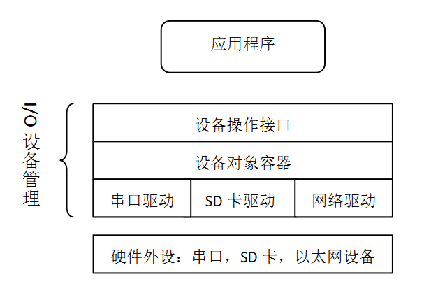

# HC32系列驱动介绍

在 RT-Thread 实时操作系统中，各种各样的设备驱动是通过一套  I/O 设备管理框架来管理的。设备管理框架给上层应用提供了一套标准的设备操作 API，开发者通过调用这些标准设备操作 API，可以高效地完成和底层硬件外设的交互。设备管理框架的结构如下图所示：

使用 I/O 设备管理框架开发应用程序，有如下优点：

- 使用同一套标准的 API 开发应用程序，使应用程序具有更好的移植性
- 底层驱动的升级和修改不会影响到上层代码
- 驱动和应用程序相互独立，方便多个开发者协同开发

## 1. 驱动分类介绍

本小节介绍 BSP 提供的不同类别驱动的概念，对一个 BSP 而言，有如下三类驱动：

- **板载外设驱动**：指 MCU 之外，开发板上外设，例如 TF 卡、以太网和 LCD 等
- **片上外设驱动**：指 MCU 芯片上的外设，例如硬件定时器、ADC 和看门狗等
- **扩展模块驱动**：指可以通过扩展接口或者杜邦线连接的开发板的模块，例如 ESP8266 模块

这三种外设的示意图如下所示：

## 2. 外设驱动的使用方法

当前 RT-Thread 提供的驱动库已经支持 HC32 多个系列的 BSP。点击下表中的驱动名称，即可跳转到对应驱动框架的介绍文档。开发者可以通过阅读相关资料，了解如何在应用开发中通过设备驱动框架来使用这些外设驱动。

### 2.1 片上外设

| 序号 | 驱动                                                         | 简介                                             |
| ---- | ------------------------------------------------------------ | ------------------------------------------------ |
| 1    | [GPIO](https://www.rt-thread.org/document/site/#/rt-thread-version/rt-thread-standard/programming-manual/device/pin/pin) | 操作 GPIO 管脚                                   |
| 2    | [UART](https://www.rt-thread.org/document/site/#/rt-thread-version/rt-thread-standard/programming-manual/device/uart/uart_v1/uart) | 通过串口收发数据                                 |
| 3    | [UART V2](https://www.rt-thread.org/document/site/#/rt-thread-version/rt-thread-standard/programming-manual/device/uart/uart_v2/uart) | 通过串口收发数据                                 |
| 4    | [soft I2C](https://www.rt-thread.org/document/site/#/rt-thread-version/rt-thread-standard/programming-manual/device/i2c/i2c) | 通过软件 I2C 收发数据                            |
| 5    | [I2C](https://www.rt-thread.org/document/site/#/rt-thread-version/rt-thread-standard/programming-manual/device/i2c/i2c) | 通过软件 I2C 收发数据                            |
| 6    | [SPI](https://www.rt-thread.org/document/site/#/rt-thread-version/rt-thread-standard/programming-manual/device/spi/spi) | 通过 SPI 收发数据                                |
| 7    | [ADC](https://www.rt-thread.org/document/site/#/rt-thread-version/rt-thread-standard/programming-manual/device/adc/adc) | 测量管脚上的模拟量                               |
| 8    | SDIO                                                         | 通过 SDIO 读写数据                               |
| 9    | [PWM](https://www.rt-thread.org/document/site/#/rt-thread-version/rt-thread-standard/programming-manual/device/pwm/pwm) | 在特定的管脚输出 PWM 波形                        |
| 10    | [RTC](https://www.rt-thread.org/document/site/#/rt-thread-version/rt-thread-standard/programming-manual/device/rtc/rtc) | 设置和读取时间                                   |
| 11   | [WDT](https://www.rt-thread.org/document/site/#/rt-thread-version/rt-thread-standard/programming-manual/device/watchdog/watchdog) | 看门狗驱动                                       |
| 12   | [QSPI](https://www.rt-thread.org/document/site/#/rt-thread-version/rt-thread-standard/programming-manual/device/spi/spi?id=配置-qspi-设备) | 通过 SPI（1、2、4线） 收发数据                   |

### 2.2 板载外设

| 序号 | 驱动    | 简介                                    |
| ---- | ------- | --------------------------------------- |
| 1    | SD      | 适用于 SPI 接口或 SDIO 接口的 SD(TF) 卡 |
| 2    | ETH PHY | 以太网                                  |
| 3    | USB PHY | USB                                     |
| 4    | LCD     | 显示屏                                  |

### 2.3 扩展模块

| 序号 | 驱动     | 简介                   |
| ---- | -------- | ---------------------- |
| 1    | ESP8266  | 串口转 WIFI 模块       |
| 2    | ENC28J60 | SPI 接口的以太网控制器 |

### 2.4 驱动示例代码

在 RT-Thread 的 `examples\test` 目录下，有 RT-Thread 提供的基于不同外设驱动的示例代码。在 env 工具中开启 BSP 中要测试的驱动，并将 `examples\test` 中对应的驱动框架测试文件加入工程，即可快速测试 BSP 中提供的驱动。